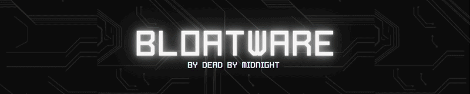
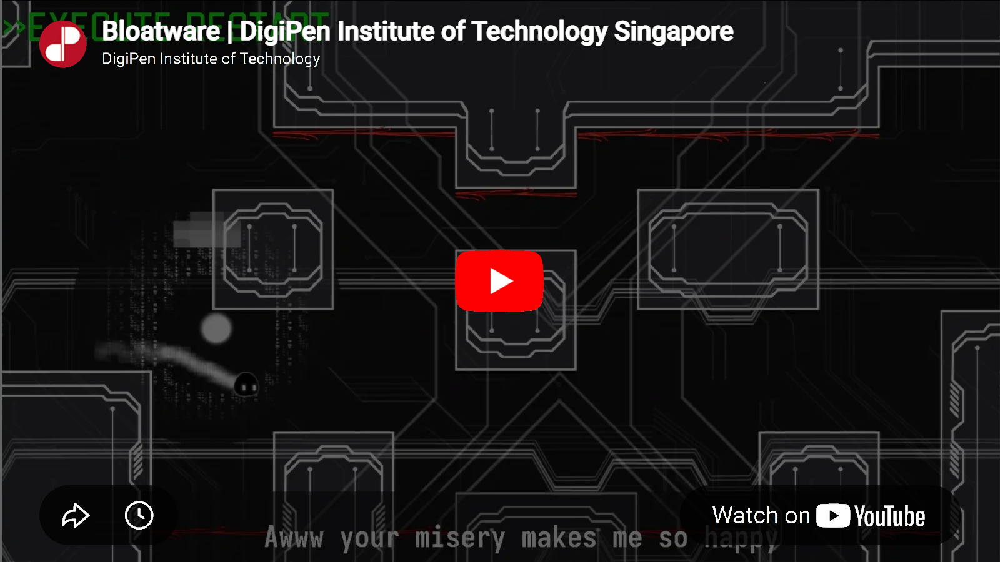

<!-- Title -->

  

<!-- Shields Icons -->

  

  

  📦 Installer available in <b><a href="./Bloatware_Installer/">Bloatware_Installer</a></b> or on the 
  <b><a href="https://www.digipen.edu.sg/showcase/student-games/bloatware">official DigiPen page</a></b>

<!-- Descriptions -->

  <b>
    Play as Byte, a hacker-virus blob trapped inside a corrupted AI system controlled by the rogue supercomputer AXIOM.
  </b>

  Master size-shifting mechanics to navigate physics-based environments, overcome adaptive AI systems, and infiltrate AXIOM’s core to deploy a destructive virus.

<!-- Trailer -->

  

## 🎮 Gameplay Showcase

  
  

  

## ✨ Features
- 🔄 Size-shifting physics gameplay
- 🧠 Adaptive AI boss with Y-axis tracking attacks
- ⚡ Precision platforming with jump leniency system
- 🧩 Key & door progression puzzles
- 🌪 Wind tunnel mechanics (size-dependent interaction)
- 🎭 Fully scripted narrative cutscenes + voiceover system

## 🗂 Project Structure
BLOATWARE is organized into two main components: a **custom engine framework** and the **game implementation layer** built on top of it.

### ⚙️ Custom Game Engine (Core Framework)
The engine provides the foundational systems that power the entire game.

It handles:
- Core game loop and scene management  
- Input handling (keyboard & controller support)  
- Physics system (collision detection, movement, constraints)  
- Rendering pipeline and visual updates  
- Audio system and event-based playback  
- Core architecture for entity and gameplay systems  

> The engine is designed as a reusable framework for 2D gameplay systems.

### 🎮 Game (BLOATWARE Build Layer)
The game layer is built on top of the engine and defines the actual playable experience. 

It includes:
- Player mechanics (size-shifting system, movement behavior)  
- AXIOM AI logic and boss behavior systems  
- Cutscenes, dialogue, and narrative scripting  
- Level design, puzzles, and progression flow  
- Gameplay interactions (lasers, wind tunnels, keys & doors)  
- Game-specific UI, VFX, and audio content  

> This layer represents the final playable build distributed to players.

### 🔗 Relationship
The engine provides systems and infrastructure, while the game defines how those systems are used to create gameplay.

## 🎮 Controls
| Action | Keyboard | Controller |
|--------|----------|------------|
| Move | ← → | D-Pad |
| Jump | ↑ | X |
| Shrink | Space (hold) | R1 |
| Jump Boost | ↑ + Space | — |
| Pause | Esc | — |
| Restart | R | — |

**Cheats**
- Skip Cutscene: O / Enter / Triangle
- Skip Levels: 1 / L1
- FPS Toggle: G
- Fullscreen: Alt + Enter

## ⚠️ Technical Notes
- Best performance when plugged in
- Alt-tab may cause rendering/audio desync
- Pause menu does not pause audio (engine limitation)
- Boss fight uses adaptive laser cooldown system
- Some cutscene pauses are intentional design

## 🎬 Game Flow
<b>Main progression loop</b>
Menu → Tutorial → Main Levels → Mid Cutscene → Boss Mode (AXIOM) → Ending → Credits → Return

## 🔊 Audio
- Event-triggered voiceover system
- Persistent BGM/SFX layers
- Contextual audio tied to gameplay and death states

<!--- Members --->
## 👥 Team Members

<table>
  <tr>
    <!--- Mong Chuan --->
    <td align="center" style="padding:20px" width=180>
      
      
<strong>Sim Mong Chuan</strong>

      
Project Manager   Production Pipeline & Debugging 

      

        <a href="https://www.linkedin.com/in/mong-chuan/" target="_blank">
        
        Mong Chuan Sim
        </a>
         
        <a href="https://github.com/mongchuan">
          
          @mongchuan
        </a>
      

    </td>
    <!--- Wen Xi --->
    <td align="center" style="padding:20px" width=180>
      
      
<strong>Teo Wen Xi</strong>

      
Technical Lead   Engine Systems 

      

        <a href="https://www.linkedin.com/in/teowenxi/" target="_blank">
        
        Teo Wen Xi
        </a>
         
        <a href="https://github.com/TeoWenXi">
          
          @TeoWenXi
        </a>
      

    </td>
    <!--- Zephan --->
    <td align="center" style="padding:20px" width=180>
      
      
<strong>Zephan Wong</strong>

      
Art & Design Lead   Audio Design & UI/UX 

      

        <a href="https://www.linkedin.com/in/zephan-wong/" target="_blank">
        
        Zephan Wong
        </a>
         
        <a href="https://github.com/zephan2000">
          
          @zephan2000
        </a>
      

    </td>
    <!--- Jovan --->
    <td align="center" style="padding:20px" width=180>
      
      
<strong>Jovan Low</strong>

      
Designer   VFX & Technical Art 

      

        <a href="https://www.linkedin.com/in/jovan-low-1b23542aa/" target="_blank">
        
        Jovan Low
        </a>
         
        <a href="https://github.com/JovanLowZhuoWen">
          
          @JovanLowZhuoWen
        </a>
      

    </td>
  </tr>
  <tr>
    <!--- Li Heng --->
    <td align="center" style="padding:20px" width=180>
      
      
<strong>Hear Li Heng</strong>

      
Programmer   Level Design Systems 

      

        <a href="https://www.linkedin.com/in/hearliheng/" target="_blank">
        
        Hear Li Heng
        </a>
         
        <a href="https://github.com/SilentflameX">
          
          @SilentflameX
        </a>
      

    </td>
    <!--- Xin Tian --->
    <td align="center" style="padding:20px" width=180>
      
      
<strong>Xin Tian Sia</strong>

      
Programmer   Physics Systems 

      

        <a href="https://www.linkedin.com/in/sia-xin-tian/" target="_blank">
        
        Xin Tian Sia
        </a>
         
        <a href="https://github.com/xintian-sia">
          
          @xintian-sia
        </a>
      

    </td>
    <!--- Wen Jin --->
    <td align="center" style="padding:20px" width=180>
      
      
<strong>Wenjin Cai</strong>

      
Programmer   Graphics Programming 

      

        <a href="https://www.linkedin.com/in/wenjin-cai/" target="_blank">
        
        Wenjin Cai
        </a>
         
        <a href="https://github.com/ZsderDigipen">
          
          @ZsderDigipen
        </a>
      

    </td>
    <!--- Kang Zheng --->
    <td align="center" style="padding:20px" width=180>
      
      
<strong>Tan Kang Zheng</strong>

      
Programmer   Gameplay Mechanics 

      

        <a href="https://www.linkedin.com/in/tankangzhengsit/" target="_blank">
        
        Tan Kang Zheng
        </a>
         
        <a href="https://github.com/TanKangZheng">
          
          @TanKangZheng
        </a>
      

    </td>
  </tr>
</table>

## 🏁 Credits
Developed by **Dead By Midnight** as part of DigiPen coursework.